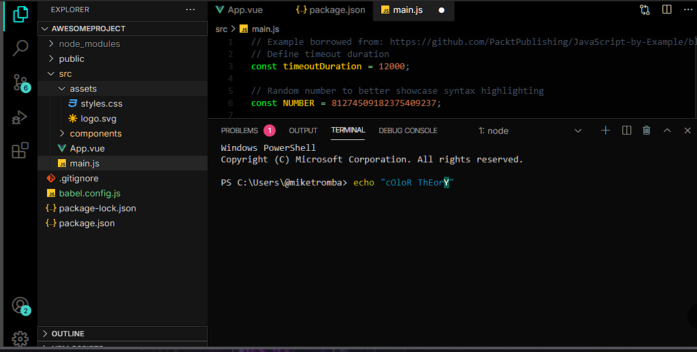

# Read Me

## Dragon's Lair is a dark and mystical theme inspired by the deep caverns of a dragon's  lair. The midnight black background sets the stage for focused coding, while the highlights evoke the magical glow of a dragon's breath. Ideal for those who seek a mythical and enchanting coding experience.

